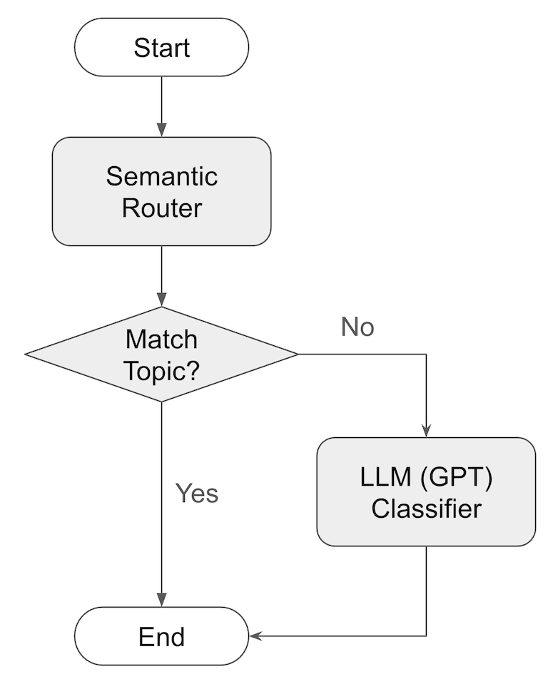

# Project Description

This project compares the performance of a baseline and a semantic router approach for classifying articles into topics.

The baseline approach classifies articles using OpenAI's GPT model.

The semantic router approach uses a combination of RedisVL's semantic router and OpenAI's GPT model to classify articles. First, the semantic router is loaded with the embeddings of articles for each topic. Then, for each article, the semantic router is used to find the topic with the highest similarity. If the article does not match any topic, the article is passed to OpenAI's GPT model to classify it.



# Instructions

## Start a Redis Instance in a Docker Container

[Docker](https://docs.docker.com/desktop/) must be installed on your machine.

To start a Redis instance, run:

```bash
docker-compose up -d
```

This runs a Redis instance in a Docker container, which can be accessed on port 6379. The Redis Stack UI can be accessed from a [web browser on port 8001](http://localhost:8001).

To stop the Redis instance, run:

```bash
docker-compose down
```

## Install Python Dependencies and Start a Virtual Environment

[Python](https://www.python.org/downloads/) must be installed on your machine.

To install the Python dependencies, run:

```bash
python3 -m venv venv
source venv/bin/activate
python3 -m pip install -r requirements.txt
```

You'll need to start the virtual environment every time you want to run the Python code.

```bash
source venv/bin/activate
```

## Set up environment variables

Create a .env file to store the environment variables. The .env file should contain the following variables:

```bash
DATASET_PATH="<path_to_labelled_dataset (BBC News Train.csv)>"
OPENAI_API_KEY="<your_openai_api_key>"
```

## Run the baseline and with router, and compare the results

Run the baseline and save the output to a file.

```bash
mkdir -p output
python3 -u src/baseline.py | tee output/baseline.txt
```

Run with router and save the output to a file.

```bash
python3 -u src/with_router.py | tee output/with_router.txt
```

Compare the results.

```bash
python3 -u src/compare.py | tee output/comparison.txt
```

## Tuning the Semantic Router

You can tune the semantic router by changing some of the configurations in `src/config.py`.

The `ROUTER_VECTORIZER` can be changed to use the `HF` or `OPENAI` vectorizer. You can also change `HF_MODEL` and `OPENAI_EMBEDDING_MODEL` to different models.

The `ROUTER_DISTANCE_THRESHOLD` is chosen as a good balance between non-matches and false matches. The lower the threshold, the more non-matches. The higher the threshold, the more false matches.

The `TRAIN_DATASET_SIZE_PER_TOPIC` can be changed to adjust the size of the references used for the semantic router.

Whenever you change the configuration, you need to remove the existing router and router configuration from Redis by running:

```bash
python3 src/delete_router.py
```

# File Descriptions

### Infrastructure

- **`docker-compose.yml`** - Docker Compose configuration for running Redis Stack in a Docker container.
- **`requirements.txt`** - Python dependencies including RedisVL, sentence transformers, and pydantic-ai for OpenAI integration.
- **`assets/`** - Contains architecture diagrams and presentation materials explaining the semantic router approach.

### Configuration and Models

- **`src/config.py`** - Central configuration file containing Redis settings, dataset parameters, OpenAI model settings, pricing information, and semantic router configuration.
- **`src/models.py`** - Pydantic data models defining the structure for articles, datasets, agent results, metrics, and enums for topics and vectorizers.

### Core Scripts

- **`src/baseline.py`** - Runs the baseline classification approach using only OpenAI's GPT model to classify articles. Processes articles in batches and saves performance metrics.
- **`src/with_router.py`** - Runs the semantic router approach that first attempts classification using RedisVL's semantic router, falling back to OpenAI's GPT model for non-matches.
- **`src/compare.py`** - Compares the performance metrics between baseline and semantic router approaches, calculating improvements in latency, cost, and accuracy.

### Data Management

- **`src/create_datasets.py`** - Handles loading and splitting the dataset into training and test sets for each topic category.
- **`src/file_utils.py`** - Utility functions for saving and loading Pydantic models to/from JSON files.

### Router Management

- **`src/create_router.py`** - Creates and manages the RedisVL semantic router, supporting both HuggingFace and OpenAI embeddings for topic classification.
- **`src/delete_router.py`** - Utility script to clean up and remove existing routers and their configurations from Redis.

### LLM Integration

- **`src/openai_utils.py`** - Handles OpenAI API integration using pydantic-ai for article classification, including cost calculation and performance tracking.
